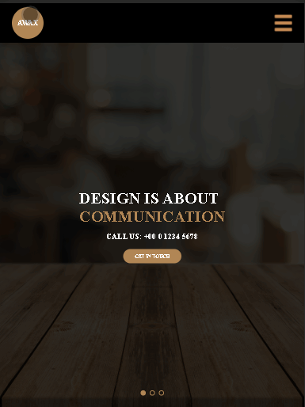
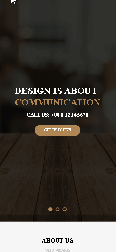

# Projeto Site Awax

 

# Descrição

Site awax é um projeto com CSS flexbox, com o objetivo de colocar meus conhecimentos em prática.
Este repositório terá constantes mudanças.

## Responsividade

   

# Tecnologias utilizadas

1. HTML
2. CSS

# Licença

A licença é MIT.

